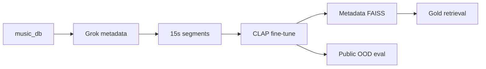

# Music CLAP retrieval — thesis project

Fine-tune [CLAP](https://github.com/LAION-AI/CLAP) on a local anime/game music library and measure **tag retrieval** on a human-labeled gold set. This repository contains the full pipeline (metadata → 15s clips → training → FAISS eval), training-text ablations, and public out-of-domain tests.

**Scale:** ~3,900 source tracks → ~65k train / ~7k val 15-second clips. **Primary tags:** piano, vocal, relaxing (`inst_piano`, `inst_vocal`, `mood_relaxing`).

**Status: research complete** (questions A–E run; reports under `data/eval/`).

---

## Research conclusion

Fine-tuning on the anime library **specializes the encoder at a clear cost to public generalization**. Within fine-tuning, the choice of **anime-only vs. mixed corpus does not produce a clean specialization–generalization tradeoff** — the effect is small and tag-dependent, with only **vocal** following the expected pattern (slightly better in-domain with anime-only; better out-of-domain with mixed training).

Supporting evidence across experiments:

- **A** — In-domain gold retrieval improves for piano and relaxing after FT; vocal is already strong pretrained.
- **B** — Replacing Grok captions with a full-corpus LLM rewrite does **not** beat the original text.
- **C** — Iterative self-train (mine → LLM → FT) **regressed** after one outer iteration.
- **D** — Tag→LLM training text vs short tag strings: **no single winner** across tags and index types.
- **E** — Anime-only (`thesis_tag_only`) vs mixed (`thesis_tag_mixed`): gold scores stay similar; OOD shifts are small and tag-specific (see 2×2 table below).
- **Public OOD** — Both FT arms sit far below pretrained on external sets; mixed training partially recovers vocal/relaxing vs anime-only only.

---

## Results at a glance

| Question | What we compared | Finding | Report |
|----------|------------------|---------|--------|
| **A** | Pretrained vs fine-tuned (`thesis_ft_v1`) | FT helps piano & relaxing on gold; vocal at ceiling | [`retrieval_vs_random_matrix.csv`](data/eval/retrieval_vs_random_matrix.csv) |
| **B** | Grok captions vs full-corpus LLM rewrite | **No gain** — keep Grok text | [`llm_full_ablation/REPORT.md`](data/eval/llm_full_ablation/REPORT.md) |
| **C** | Single FT vs self-train loop | **Negative** — iter 1 regressed | [`docs/agent_runs/20260526_self_train_v2/`](docs/agent_runs/20260526_self_train_v2/) |
| **D** | Tag-only vs tag→LLM training text | **Mixed** — tag-dependent, no clear winner | [`tag_llm_ablation/REPORT.md`](data/eval/tag_llm_ablation/REPORT.md) |
| **E** | Anime-only vs mixed-domain FT (2×2 gold × OOD) | **No clean tradeoff** — small, tag-dependent shifts | [`domain_tradeoff/REPORT.md`](data/eval/domain_tradeoff/REPORT.md) |

Public OOD (all FT arms vs pretrained): [`data/eval/REPORT.md`](data/eval/REPORT.md).

---

## Main result (A) — fine-tuning vs pretrained

Gold retrieval @K=10 on ~200 human-labeled songs (metadata FAISS). Same pool and queries for both arms.

| Query | Pretrained prec@10 / nDCG@10 | Fine-tuned prec@10 / nDCG@10 |
|-------|------------------------------|------------------------------|
| piano | 0.20 / 0.359 | **0.30 / 0.428** |
| vocal | 1.00 / 1.00 | 1.00 / 1.00 |
| relaxing | 0.50 / 0.537 | **0.60 / 0.652** |

Run: `thesis_ft_v1` (seeds 42–44). Checkpoints: `model/clap/finetune/thesis_ft_v1/seed_*/best_model.pt`.

---

## Domain tradeoff (E) — anime-only vs mixed @K=10

Mean over seeds 42–44. **Gold** = in-domain human labels. **OOD** = macro mean over Jamendo, MTAT, OpenMIC.

| Tag | Anime-only / Gold | Mixed / Gold | Anime-only / OOD | Mixed / OOD |
|-----|-------------------|--------------|------------------|-------------|
| piano | 0.20 | 0.30 | 0.70 | 0.69 |
| vocal | **1.00** | 0.90 | 0.37 | **0.53** |
| relaxing | 0.50 | 0.50 | 0.28 | **0.40** |

Pretrained OOD reference (macro): piano 0.98, vocal 0.76, relaxing 0.53 — both FT arms remain well below pretrained on public data.

---

## How it works



1. Grok metadata → 15s clips → contrastive CLAP fine-tune (val early-stop).
2. In-domain eval: text query → FAISS → precision / nDCG on human gold.
3. Ablations vary **training text** or **training corpus**; eval protocol stays fixed.
4. Public OOD scores checkpoints without further training.

---

## What is in the repo

- Data pipeline, multi-seed fine-tune, gold eval, ablation Slurm scripts
- Reports: `data/eval/*/REPORT.md`, retrieval matrices, progress monitor (`bash scripts/refresh_progress.sh`)

Details: [`AGENTS.md`](AGENTS.md), [`docs/THESIS_QUESTIONS.md`](docs/THESIS_QUESTIONS.md), [`docs/OPERATIONS.md`](docs/OPERATIONS.md).

---

## Quick start

```bash
conda activate ragweb   # or: python -m venv .venv && source .venv/bin/activate
pip install -r requirements.txt
```

Backbone: `model/clap/music_audioset_epoch_15_esc_90.14.pt`. Reproduce headline eval:

```bash
python -m app.metadata_faiss build --min-confidence 0.35
python -m app.data_handling.music_eval_retrieval_vs_random --top-k 10
export RAGWEB_CLAP_CHECKPOINT=model/clap/finetune/thesis_ft_v1/seed_42/best_model.pt
python -m app.data_handling.music_eval_retrieval_vs_random --top-k 10
```

Fine-tune tutorial: [`docs/FINE_TUNING_TUTORIAL.md`](docs/FINE_TUNING_TUTORIAL.md).

---

## Documentation

| Doc | Purpose |
|-----|---------|
| [`docs/THESIS_QUESTIONS.md`](docs/THESIS_QUESTIONS.md) | Questions A–E, run IDs, commands |
| [`docs/PROGRESS.md`](docs/PROGRESS.md) | Experiment status snapshot |
| [`docs/DOMAIN_TRADEOFF.md`](docs/DOMAIN_TRADEOFF.md) | Question E protocol |
| [`docs/FINE_TUNING_TUTORIAL.md`](docs/FINE_TUNING_TUTORIAL.md) | Train + eval checkpoints |
| [`docs/OPERATIONS.md`](docs/OPERATIONS.md) | Operator commands |

---

## Data layout

| Path | Contents |
|------|----------|
| `data/music_db` / `data/music_db_15s` | Source audio / 15s segments |
| `data/mapping` | Metadata, manifests |
| `data/eval` | Gold labels, **reports**, matrices |
| `model/clap/finetune/` | Checkpoints (gitignored) |

Large assets are gitignored; `data/eval/` reports are the committed evidence trail.
