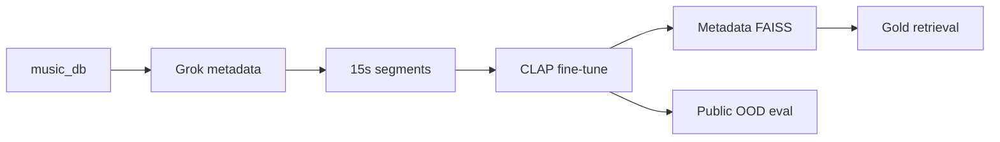

# Music CLAP retrieval — thesis project

Fine-tune [CLAP](https://github.com/LAION-AI/CLAP) on a local anime/game music library and measure **tag retrieval** on a human-labeled gold set. This repository contains the full pipeline (metadata → 15s clips → training → FAISS eval), training-text ablations, and public out-of-domain tests.

**Scale:** ~3,900 source tracks → ~65k train / ~7k val 15-second clips. **Primary tags:** piano, vocal, relaxing (`inst_piano`, `inst_vocal`, `mood_relaxing`).

**Status: research complete** (questions A–E run; reports under `data/eval/`).

---

## Gold retrieval improvements (headline)

**Eval:** ~200 human-labeled songs, metadata FAISS index, precision@10 and nDCG@10.  
**Main comparison (Question A):** pretrained AudioSet CLAP vs fine-tuned `thesis_ft_v1` (Grok captions, seeds 42–44).

| Tag | Pretrained P@10 | Fine-tuned P@10 | **Δ P@10** | Pretrained nDCG@10 | Fine-tuned nDCG@10 | **Δ nDCG** |
|-----|-----------------|-----------------|------------|--------------------|--------------------|------------|
| piano | 0.20 | **0.30** | **+0.10** | 0.359 | **0.428** | **+0.069** |
| vocal | 1.00 | 1.00 | 0.00 | 1.00 | 1.00 | 0.00 |
| relaxing | 0.50 | **0.60** | **+0.10** | 0.537 | **0.652** | **+0.115** |

**Takeaway:** Fine-tuning **does improve** in-domain gold retrieval on piano and relaxing (+10 pp precision each, higher nDCG). Vocal is already at ceiling before FT. This is the primary positive result — specialization **works on the gold set** for the tags that were weak pretrained.

Source: [`data/eval/retrieval_vs_random_matrix.csv`](data/eval/retrieval_vs_random_matrix.csv) (pretrained rows); fine-tuned rows with `RAGWEB_CLAP_CHECKPOINT=thesis_ft_v1/seed_42/best_model.pt`.

### Other experiments on gold (same eval pool)

| Comparison | Piano Δ P@10 | Vocal Δ P@10 | Relaxing Δ P@10 | Note |
|------------|--------------|--------------|-----------------|------|
| **B** Grok vs LLM captions (FT) | −0.07 | −0.17 | 0.00 | LLM rewrite **does not** beat Grok on gold |
| **D** tag-only vs tag→LLM text (FT) | 0.00 | 0.00 | **+0.10** | tag→LLM helps relaxing only (metadata index) |
| **E** anime-only vs mixed corpus (FT) | **+0.10** | −0.10 | 0.00 | Mixed helps piano on gold; vocal slightly worse |

Reports: [`llm_full_ablation/REPORT.md`](data/eval/llm_full_ablation/REPORT.md), [`tag_llm_ablation/REPORT.md`](data/eval/tag_llm_ablation/REPORT.md), [`domain_tradeoff/REPORT.md`](data/eval/domain_tradeoff/REPORT.md).

---

## Research conclusion

**In-domain:** Fine-tuning on the anime library **improves gold retrieval** (piano +0.10, relaxing +0.10 P@10 vs pretrained). **Out-of-domain:** that same specialization **hurts** public retrieval — both FT arms sit far below pretrained on Jamendo / MTAT / OpenMIC.

Within fine-tuning choices (caption rewrite, tag text, anime vs mixed corpus), **gold gains are small or absent** except the main A result and isolated tag-level shifts — anime-only vs mixed does **not** produce a clean specialization–generalization tradeoff; effects are tag-dependent (vocal: slightly better in-domain with anime-only, better OOD with mixed).

- **B** — LLM caption rewrite does not beat Grok on gold.
- **C** — Self-train loop regressed after one iteration.
- **D** — Tag→LLM vs tag-only: no single winner on gold across all tags.
- **Public OOD** — [`data/eval/REPORT.md`](data/eval/REPORT.md): pretrained piano 0.98 / vocal 0.76 vs FT ~0.7 / ~0.37 (anime-only macro).

---

## Results at a glance

| Question | What we compared | Gold finding | Report |
|----------|------------------|--------------|--------|
| **A** | Pretrained vs `thesis_ft_v1` | **+0.10 P@10** piano & relaxing | [`retrieval_vs_random_matrix.csv`](data/eval/retrieval_vs_random_matrix.csv) |
| **B** | Grok vs LLM captions | No gold gain (LLM worse on piano/vocal) | [`llm_full_ablation/REPORT.md`](data/eval/llm_full_ablation/REPORT.md) |
| **C** | Single FT vs self-train | Negative | [`docs/agent_runs/20260526_self_train_v2/`](docs/agent_runs/20260526_self_train_v2/) |
| **D** | Tag-only vs tag→LLM | Mixed (+0.10 relaxing on metadata index) | [`tag_llm_ablation/REPORT.md`](data/eval/tag_llm_ablation/REPORT.md) |
| **E** | Anime-only vs mixed FT | Gold similar; piano +0.10 with mixed | [`domain_tradeoff/REPORT.md`](data/eval/domain_tradeoff/REPORT.md) |

---

## Domain tradeoff (E) — gold × OOD @K=10

Mean over seeds 42–44.

| Tag | Anime-only / **Gold** | Mixed / **Gold** | Δ Gold | Anime-only / OOD | Mixed / OOD | Δ OOD |
|-----|----------------------|------------------|--------|------------------|-------------|-------|
| piano | 0.20 | **0.30** | **+0.10** | 0.70 | 0.69 | −0.01 |
| vocal | **1.00** | 0.90 | −0.10 | 0.37 | **0.53** | +0.17 |
| relaxing | 0.50 | 0.50 | 0.00 | 0.28 | **0.40** | +0.12 |

Pretrained OOD reference (macro): piano 0.98, vocal 0.76, relaxing 0.53.

---

## How it works



1. Grok metadata → 15s clips → contrastive CLAP fine-tune (val early-stop).
2. **Primary metric:** text query → FAISS → P@K / nDCG on human gold (~200 songs).
3. Ablations vary training text or corpus; gold eval protocol stays fixed.
4. Public OOD is a **separate** post-train test (not the main claim).

---

## What is in the repo

- Data pipeline, multi-seed fine-tune, gold eval, ablation Slurm scripts
- Reports: `data/eval/*/REPORT.md`, retrieval matrices, progress monitor (`bash scripts/refresh_progress.sh`)

Details: [`AGENTS.md`](AGENTS.md), [`docs/THESIS_QUESTIONS.md`](docs/THESIS_QUESTIONS.md), [`docs/OPERATIONS.md`](docs/OPERATIONS.md).

---

## Quick start

```bash
conda activate ragweb   # or: python -m venv .venv && source .venv/bin/activate
pip install -r requirements.txt
```

Backbone: `model/clap/music_audioset_epoch_15_esc_90.14.pt`. Reproduce headline gold eval:

```bash
python -m app.metadata_faiss build --min-confidence 0.35
python -m app.data_handling.music_eval_retrieval_vs_random --top-k 10
export RAGWEB_CLAP_CHECKPOINT=model/clap/finetune/thesis_ft_v1/seed_42/best_model.pt
python -m app.data_handling.music_eval_retrieval_vs_random --top-k 10
```

Fine-tune tutorial: [`docs/FINE_TUNING_TUTORIAL.md`](docs/FINE_TUNING_TUTORIAL.md).

---

## Documentation

| Doc | Purpose |
|-----|---------|
| [`docs/THESIS_QUESTIONS.md`](docs/THESIS_QUESTIONS.md) | Questions A–E, run IDs, commands |
| [`docs/PROGRESS.md`](docs/PROGRESS.md) | Experiment status snapshot |
| [`docs/DOMAIN_TRADEOFF.md`](docs/DOMAIN_TRADEOFF.md) | Question E protocol |
| [`docs/FINE_TUNING_TUTORIAL.md`](docs/FINE_TUNING_TUTORIAL.md) | Train + eval checkpoints |
| [`docs/OPERATIONS.md`](docs/OPERATIONS.md) | Operator commands |

---

## Data layout

| Path | Contents |
|------|----------|
| `data/music_db` / `data/music_db_15s` | Source audio / 15s segments |
| `data/mapping` | Metadata, manifests |
| `data/eval` | Gold labels, **reports**, matrices |
| `model/clap/finetune/` | Checkpoints (gitignored) |

Large assets are gitignored; `data/eval/` reports are the committed evidence trail.
