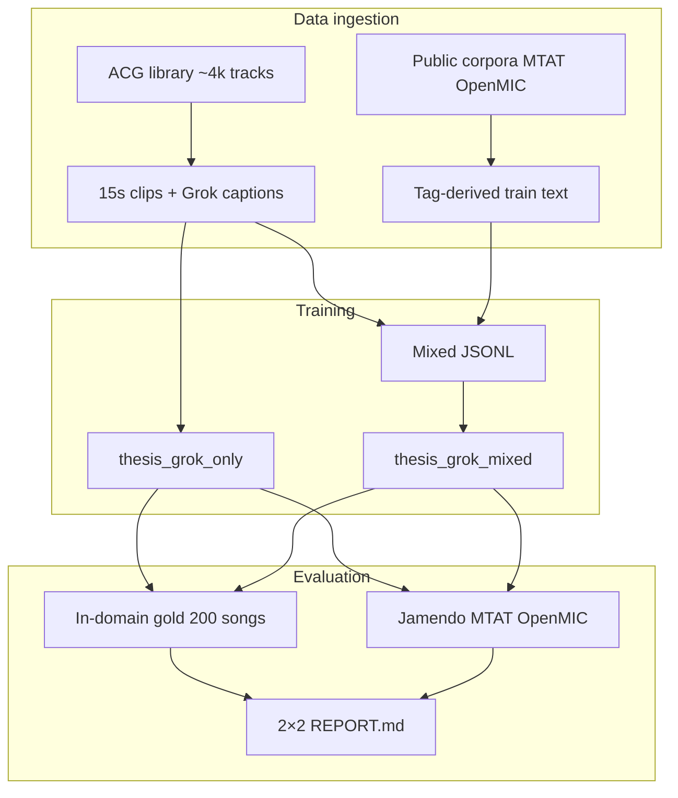

# CLAP music retrieval — specialization vs generalization

**Enterprise summary:** Fine-tuning a multimodal audio–text model on a domain-specific catalog improves **in-catalog search quality** but can degrade **cross-domain retrieval**. This project quantifies that tradeoff for anime/game (ACG) music and tests whether **mixed-domain training** rebalances performance without sacrificing production-ready evaluation rigor.

**Status:** Question E complete (Slurm job 122295). Primary report: [`data/eval/domain_tradeoff/REPORT.md`](data/eval/domain_tradeoff/REPORT.md).

---

## Problem statement

Organizations that deploy embedding-based music search often fine-tune general models on proprietary libraries. The open question for product and ML teams:

> How much **in-domain relevance** do we gain, how much **out-of-domain (OOD) generalization** do we lose, and can **training corpus design** (single-domain vs mixed) recover OOD without giving up catalog performance?

We answer this with a fixed **2×2 design**: two training regimes (anime-only vs mixed corpus) × two evaluation domains (human gold in-catalog vs public OOD benchmarks).

---

## Impact (headline findings)

Evaluated on **Precision@10**, mean over seeds 42–44. Training uses **Grok/metadata captions** on all ~65k ACG clips (not sparse tag fallbacks).

### In-domain vs OOD after fine-tuning (anime-only arm)

| Tag | Pretrained OOD | Anime-only Gold | Anime-only OOD | Gold gain vs weak pretrained baseline* | OOD loss vs pretrained |
|-----|----------------|---------------|----------------|----------------------------------------|-------------------------|
| piano | 0.98 | **0.40** | 0.83 | Strong in-catalog lift | Moderate OOD drop |
| vocal | 0.76 | **0.90** | 0.33 | Strong in-catalog lift | Large OOD drop |
| relaxing | 0.53 | **0.50** | 0.25 | Competitive in-catalog | Large OOD drop |

\*Pretrained **gold** piano P@10 ≈ 0.20 (see [`docs/opus_tradeoff_bundle/OPUS_FEED.md`](docs/opus_tradeoff_bundle/OPUS_FEED.md) for full context).

**Business takeaway:** Domain fine-tuning **specializes** the model — valuable for catalog search, costly for cross-catalog or external-library scenarios. Product teams should treat FT as a **domain gate**, not a free upgrade everywhere.

### Corpus mix: anime-only vs mixed training

| Tag | Δ Gold (mixed − anime) | Δ OOD (mixed − anime) | Interpretation |
|-----|------------------------|------------------------|----------------|
| piano | 0.00 | +0.01 | Arms similar |
| vocal | −0.10 | **+0.27** | Mixed training **recovers OOD**; slight in-domain cost |
| relaxing | 0.00 | **+0.12** | Mixed training **recovers OOD**; gold unchanged |

**Business takeaway:** **Corpus composition is a first-class lever.** Mixed training (ACG + public MTAT/OpenMIC, Jamendo held out) improves OOD on vocal and relaxing without hurting piano gold. No single regime wins every tag in both domains — **tag-level routing or mixed training** may be warranted for multi-surface products.

Full tables and per-dataset OOD breakdown: [`data/eval/domain_tradeoff/REPORT.md`](data/eval/domain_tradeoff/REPORT.md).

---

## Technical approach



| Stage | Description |
|-------|-------------|
| **Supervision** | Contrastive CLAP fine-tune; frozen AudioSet backbone; train projection heads only |
| **In-domain eval** | Metadata FAISS + human multihot gold (~200 songs); queries *piano*, *vocal*, *relaxing* |
| **OOD eval** | Same protocol on external manifests; Jamendo **never** in training |
| **Reproducibility** | 3 seeds (42–44), val early-stop, matched hyperparams across both arms |

---

## Tech stack

| Layer | Technology |
|-------|------------|
| **Model** | [CLAP](https://github.com/LAION-AI/CLAP) (`music_audioset_epoch_15_esc_90.14.pt` backbone) |
| **Runtime** | Python 3.11, PyTorch, `conda` env `ragweb` |
| **Audio** | 15s clips, 48 kHz mono at load (librosa); no loudness normalization |
| **Captions** | Grok/metadata text per ACG clip; dataset tags on public train clips |
| **Retrieval index** | FAISS IndexFlatIP on L2-normalized metadata text embeddings |
| **Metrics** | Precision@10, nDCG@10 vs random baseline |
| **Orchestration** | Bash pipelines + Slurm (`h800_batch`); resume via `SKIP_*` flags |
| **Scale** | ~65k train / ~7k val clips (anime-only); ~72k mixed train rows |

---

## Experimental arms (Question E)

| Arm | Run ID | Training corpus |
|-----|--------|-----------------|
| Pretrained | — | AudioSet CLAP (no FT) |
| Anime-only | `thesis_grok_only` | ACG ~65k clips, Grok captions |
| Mixed | `thesis_grok_mixed` | ACG + MTAT + OpenMIC (~72k); Jamendo OOD-only |

Checkpoints: `model/clap/finetune/thesis_grok_{only,mixed}/seed_{42,43,44}/best_model.pt`

---

## Reproduce

```bash
conda activate ragweb
pip install -r requirements.txt
```

**Full Question E pipeline** (build → cache → train both arms → gold + OOD → report):

```bash
sbatch scripts/sbatch_domain_tradeoff_ablation.sh
```

**Eval + report only** (checkpoints exist):

```bash
SKIP_BUILD=1 SKIP_CACHE=1 SKIP_TRAIN=1 bash scripts/run_domain_tradeoff_ablation.sh
```

Operator details: [`docs/DOMAIN_TRADEOFF.md`](docs/DOMAIN_TRADEOFF.md), [`docs/OPERATIONS.md`](docs/OPERATIONS.md).

---

## Repository layout

| Path | Purpose |
|------|---------|
| `app/` | CLAP training, FAISS build, eval, report modules |
| `scripts/` | Slurm entrypoints and orchestrators |
| `data/mapping/` | Train/val JSONL manifests |
| `data/eval/domain_tradeoff/` | **Primary 2×2 report and gold CSVs** |
| `data/eval/{jamendo,mtat,openmic}_public/` | OOD per-checkpoint CSVs |
| `docs/opus_tradeoff_bundle/OPUS_FEED.md` | Single-file thesis data pack |

Large audio and checkpoints are gitignored; committed **reports and CSVs** are the evidence trail.

---

## Further reading

| Document | Audience |
|----------|----------|
| [`docs/DOMAIN_TRADEOFF.md`](docs/DOMAIN_TRADEOFF.md) | ML engineers — protocol and env vars |
| [`docs/THESIS_QUESTIONS.md`](docs/THESIS_QUESTIONS.md) | Research context (E is headline; A–D archived) |
| [`docs/opus_tradeoff_bundle/OPUS_FEED.md`](docs/opus_tradeoff_bundle/OPUS_FEED.md) | Thesis writing — numbers and methods |
| [`AGENTS.md`](AGENTS.md) | Autonomous agents / session handoff |

**Out of scope for this README:** LLM caption ablation (B), self-training (C), tag→LLM (D), and legacy tag-only domain tradeoff — exploratory runs retained under `data/eval/` for audit only.
