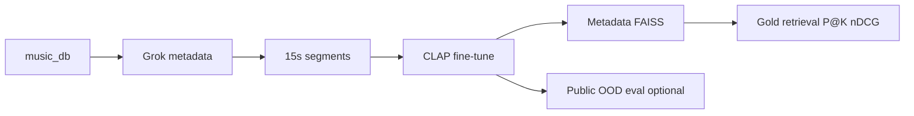

# Music CLAP retrieval — thesis project

Fine-tune [CLAP](https://github.com/LAION-AI/CLAP) on a local anime/game music library and measure **tag retrieval** on a human-labeled gold set. The repo holds the full pipeline (metadata → 15s clips → training → FAISS eval) plus ablations on **training text** and optional **public out-of-domain** tests.

**Scale:** ~3,900 source tracks → ~65k train / ~7k val 15-second clips. **Primary evaluation tags:** piano, vocal, relaxing (`inst_piano`, `inst_vocal`, `mood_relaxing`).

---

## Results at a glance

| Question | What we compared | Finding | Report |
|----------|------------------|---------|--------|
| **A** | Pretrained CLAP vs fine-tuned (`thesis_ft_v1`) | **Fine-tuning helps** on piano and relaxing; vocal already strong at pretrained | [`retrieval_vs_random_matrix.csv`](data/eval/retrieval_vs_random_matrix.csv) |
| **B** | Original Grok captions vs full-corpus LLM rewrite | **No consistent gain**; Grok text is the better training default | [`llm_full_ablation/REPORT.md`](data/eval/llm_full_ablation/REPORT.md) |
| **C** | Single FT vs self-train loop (mine → LLM → FT) | **Negative** — iteration 1 regressed | [`docs/agent_runs/20260526_self_train_v2/`](docs/agent_runs/20260526_self_train_v2/) |
| **D** | Short tag strings vs tag→LLM expanded text | **Mixed** — tag→LLM helps relaxing on metadata index; no single winner on all tags/indexes | [`tag_llm_ablation/REPORT.md`](data/eval/tag_llm_ablation/REPORT.md) |
| **E** | Anime-only vs mixed-domain FT (forgetting vs specialization) | Pipeline ready; **run pending** | [`docs/DOMAIN_TRADEOFF.md`](docs/DOMAIN_TRADEOFF.md) |

**Public OOD** (Jamendo / MTAT / OpenMIC) is separate from A–E: it scores existing checkpoints on external audio without training. See [`data/eval/REPORT.md`](data/eval/REPORT.md).

---

## Main result (Question A) — fine-tuning vs pretrained

Gold retrieval @K=10 on ~200 human-labeled songs (metadata FAISS index). Same eval pool and queries for both arms.

| Query | Pretrained prec@10 / nDCG@10 | Fine-tuned prec@10 / nDCG@10 |
|-------|------------------------------|------------------------------|
| piano | 0.20 / 0.359 | **0.30 / 0.428** |
| vocal | 1.00 / 1.00 | 1.00 / 1.00 |
| relaxing | 0.50 / 0.537 | **0.60 / 0.652** |

Fine-tune run: `thesis_ft_v1` (seeds 42–44; metrics stable across seeds). Checkpoints: `model/clap/finetune/thesis_ft_v1/seed_*/best_model.pt`.

**Takeaway:** Supervised FT on in-domain captions gives modest but consistent gains where pretrained CLAP was weakest; it does not fix every tag (orchestral, sad, tempo rows remain weak — see full matrix CSV).

---

## How it works



1. **Metadata** — Grok extracts tags/text from filenames (`music_metadata.json`).
2. **Clips** — Full tracks split to 15s; train/val JSONL by source song.
3. **Training** — Contrastive CLAP fine-tune; early-stop on val clip similarity.
4. **In-domain eval** — Text query → FAISS over catalog metadata; score vs human multihot gold (not vs random as the main claim — deltas vs random are in the CSV for context).
5. **Ablations** — Change only **training text** (Grok, LLM rewrite, tags) or training recipe (self-train); same eval protocol.

---

## What is in the repo

- **Data pipeline** — 15s split, train/val manifests, optional audio embedding cache for fast FT.
- **Multi-seed fine-tune** — `python -m app.train_clap_multiseed` + Slurm drivers.
- **Gold evaluation** — Human multihot labels merged with BPM tempo; retrieval-vs-random matrix.
- **Ablations** — LLM caption rewrite (B), tag / tag→LLM training text (D), domain tradeoff (E).
- **Cluster scripts** — `scripts/sbatch_*.sh` for long GPU jobs; progress monitor: `bash scripts/refresh_progress.sh` → [`docs/PROGRESS.md`](docs/PROGRESS.md).

Code entry points and agent context: [`AGENTS.md`](AGENTS.md). Full experiment map: [`docs/THESIS_QUESTIONS.md`](docs/THESIS_QUESTIONS.md).

---

## Quick start

### Environment

```bash
python -m venv .venv && source .venv/bin/activate   # or: conda activate ragweb
pip install -r requirements.txt
```

Place the CLAP backbone at `model/clap/music_audioset_epoch_15_esc_90.14.pt` (see `config/settings.py`). Optional `.env` for Grok API if rebuilding metadata.

### Reproduce headline eval (Question A)

```bash
# Build metadata FAISS index (once)
python -m app.metadata_faiss build --min-confidence 0.35

# Pretrained retrieval matrix
python -m app.data_handling.music_eval_retrieval_vs_random --top-k 10

# Fine-tuned: set checkpoint then re-run same command
export RAGWEB_CLAP_CHECKPOINT=model/clap/finetune/thesis_ft_v1/seed_42/best_model.pt
python -m app.data_handling.music_eval_retrieval_vs_random --top-k 10
```

Fine-tune from scratch: [`docs/FINE_TUNING_TUTORIAL.md`](docs/FINE_TUNING_TUTORIAL.md). Gold merge semantics: [`docs/README_eval_merge.md`](docs/README_eval_merge.md).

---

## Documentation

| Doc | Purpose |
|-----|---------|
| [`docs/THESIS_QUESTIONS.md`](docs/THESIS_QUESTIONS.md) | Questions A–E, run IDs, commands, outputs |
| [`docs/PROGRESS.md`](docs/PROGRESS.md) | Live experiment status (`bash scripts/refresh_progress.sh`) |
| [`docs/PROGRESS_MONITOR.md`](docs/PROGRESS_MONITOR.md) | How to read the progress dashboard |
| [`docs/FINE_TUNING_TUTORIAL.md`](docs/FINE_TUNING_TUTORIAL.md) | Train + eval checkpoints |
| [`docs/RESEARCH_DIRECTIONS.md`](docs/RESEARCH_DIRECTIONS.md) | Interpretation and follow-up ideas |
| [`docs/OPERATIONS.md`](docs/OPERATIONS.md) | Operator commands (metadata, gold build, Slurm) |

---

## Data layout

| Path | Contents |
|------|----------|
| `data/music_db` | Source audio |
| `data/music_db_15s` | 15s segments |
| `data/mapping` | Metadata, manifests, eval sidecars |
| `data/eval` | Gold labels, reports, retrieval matrices |
| `data/index` | FAISS indexes |
| `model/clap/finetune/` | Fine-tuned checkpoints (not in git) |

---

## Notes

- Large assets (audio, models, caches, indexes) are gitignored; reports and manifests in `data/eval/` are the committed evidence trail.
- Primary reporting uses **three tags only**; other gold columns exist for reference.
- For Slurm / cloud protocol: [`docs/cloud_finetune_protocol.md`](docs/cloud_finetune_protocol.md).
