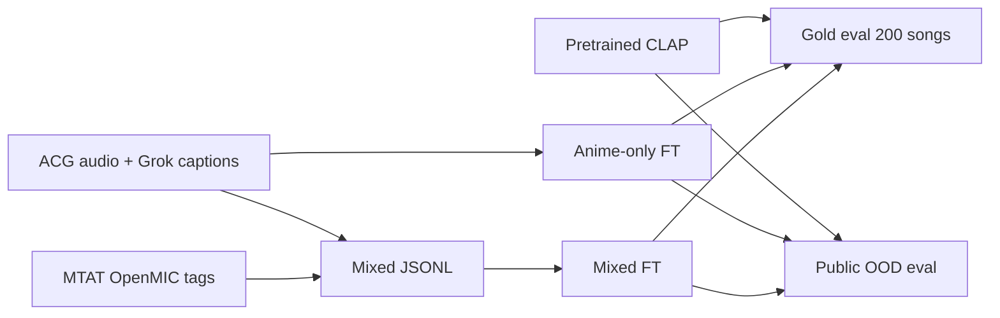

# CLAP music retrieval — specialization vs generalization

Fine-tune a **multimodal audio–text encoder** (CLAP) on a domain-specific music catalog and measure the **specialization–generalization tradeoff**: in-catalog retrieval vs public out-of-domain (OOD) retrieval, comparing **pretrained**, **anime-only**, and **mixed-corpus** training.

**Status:** Complete (Slurm job 122295). Evidence: [`data/eval/domain_tradeoff/REPORT.md`](data/eval/domain_tradeoff/REPORT.md).

---

## Research question

When CLAP is fine-tuned on an ACG music catalog with Grok/metadata captions:

1. How does **in-domain gold retrieval** (human-labeled pool) change vs the pretrained backbone?
2. How does **public OOD retrieval** change on Jamendo, MTAT, and OpenMIC?
3. Does **mixed-domain training** (ACG + MTAT/OpenMIC; Jamendo held out) shift that balance vs anime-only fine-tuning?

Same eval protocol throughout: fixed queries, metadata FAISS index, P@10; only checkpoint and training corpus differ.

---

## Results — in-domain gold (P@10)

**Eval pool:** ~200 human-labeled songs, 3 tags (`piano`, `vocal`, `relaxing`).  
**Index:** metadata-text FAISS (in-catalog).  
**Fine-tuned arms:** mean over seeds 42–44 (`thesis_grok_only`, `thesis_grok_mixed`).  
**Pretrained baseline:** single run, same gold protocol ([`retrieval_vs_random_matrix.csv`](data/eval/retrieval_vs_random_matrix.csv)).

| Tag | Pretrained | Anime-only FT | Mixed FT |
|-----|------------|---------------|----------|
| piano | 0.20 | **0.40** | **0.40** |
| vocal | 0.70 | **0.90** | 0.80 |
| relaxing | 0.50 | 0.50 | 0.50 |

**Summary:** Fine-tuning raises gold P@10 on piano (+0.20) and vocal (+0.20, anime-only vs pretrained). Mixed matches anime-only on piano and relaxing; vocal gold is −0.10 vs anime-only.

---

## Results — public OOD (P@10 macro)

**Eval pools:** Jamendo, MTAT, OpenMIC (Jamendo **never** in training).  
**Metric:** macro mean P@10 over datasets per tag (same as domain tradeoff report).  
**Fine-tuned arms:** mean over seeds 42–44.

| Tag | Pretrained | Anime-only FT | Mixed FT |
|-----|------------|---------------|----------|
| piano | 0.98 | 0.83 | 0.84 |
| vocal | 0.76 | 0.33 | **0.60** |
| relaxing | 0.53 | 0.25 | **0.37** |

**Summary:** Fine-tuning lowers OOD vs pretrained (largest drop on vocal and relaxing). Mixed training improves OOD vs anime-only on vocal (+0.27) and relaxing (+0.12).

Per-dataset OOD: [`data/eval/domain_tradeoff/REPORT.md`](data/eval/domain_tradeoff/REPORT.md).

**Training text:** Grok/metadata on ACG clips (`clap_train_15s.jsonl`); MTAT/OpenMIC tag strings in the mixed arm only.

---

## Skills demonstrated (tech stack)

| Area | What this project shows |
|------|-------------------------|
| **Multimodal ML** | Contrastive fine-tuning of CLAP (frozen AudioSet backbone, train projection heads); audio–text alignment at scale |
| **Deep learning ops** | PyTorch training loops, val early-stopping, multi-seed runs (42–44), backbone **audio embedding cache** for reproducible throughput |
| **Retrieval & search** | FAISS IndexFlatIP, L2-normalized embeddings, text-query → metadata retrieval, P@K / nDCG vs random baseline |
| **Evaluation design** | Human gold multihot labels, held-out public OOD sets, strict leakage rules (Jamendo OOD-only), 2×2 train×eval matrix |
| **Data engineering** | 15s clip manifests (JSONL), ~65k–72k row training corpora, holdout path audits, mixed-domain dataset joins |
| **Audio ML pipeline** | librosa load (48 kHz mono), segment extraction, batch embedding precompute |
| **MLOps / HPC** | End-to-end Bash orchestrators, Slurm GPU jobs (H800), idempotent pipelines with `SKIP_*` resume flags |
| **Experiment tracking** | Versioned CSV/JSON reports, `summary.json`, Slurm logs, agent run artifacts under `docs/agent_runs/` |
| **LLM-assisted metadata** | Grok-generated per-clip training captions vs sparse tag-only baselines |

**Core stack:** Python 3.11 · PyTorch · CLAP · FAISS · librosa · Slurm · Bash

---

## Architecture



| Arm | Run ID | Train data |
|-----|--------|------------|
| Pretrained | — | None |
| Anime-only | `thesis_grok_only` | `clap_train_15s.jsonl` (~65k) |
| Mixed | `thesis_grok_mixed` | Grok ACG + MTAT/OpenMIC (~72k) |

---

## Reproduce

```bash
conda activate ragweb && pip install -r requirements.txt
sbatch scripts/sbatch_domain_tradeoff_ablation.sh
```

Eval-only (checkpoints exist): `SKIP_BUILD=1 SKIP_CACHE=1 SKIP_TRAIN=1 bash scripts/run_domain_tradeoff_ablation.sh`

Details: [`docs/DOMAIN_TRADEOFF.md`](docs/DOMAIN_TRADEOFF.md) · [`docs/OPERATIONS.md`](docs/OPERATIONS.md)

---

## Repository

| Path | Contents |
|------|----------|
| `data/eval/domain_tradeoff/` | **Primary report**, gold CSVs, `summary.json` |
| `data/eval/{jamendo,mtat,openmic}_public/` | OOD CSVs per checkpoint |
| `model/clap/finetune/thesis_grok_*/` | Fine-tuned weights (gitignored) |
| `docs/opus_tradeoff_bundle/OPUS_FEED.md` | Thesis numbers pack |

[`AGENTS.md`](AGENTS.md) · [`docs/THESIS_QUESTIONS.md`](docs/THESIS_QUESTIONS.md)
