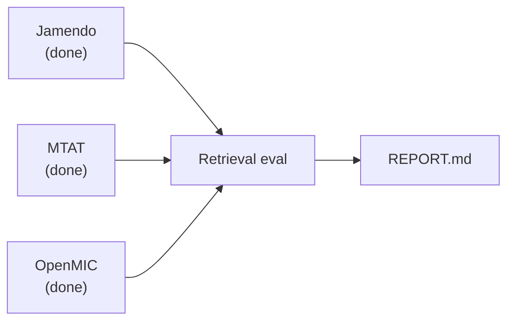

# Progress monitor

*Auto-generated — do not edit by hand. Last refresh: `2026-07-02T02:13:55Z`*

Refresh:

```bash
bash scripts/refresh_progress.sh
```

Guide: [`docs/PROGRESS_MONITOR.md`](PROGRESS_MONITOR.md). Objectives: [`docs/THESIS_QUESTIONS.md`](THESIS_QUESTIONS.md). Public OOD: [`docs/PUBLIC_OOD_EVAL.md`](PUBLIC_OOD_EVAL.md).

## Thesis questions

| ID | Topic | Status | Report / artifacts |
|----|-------|--------|-------------------|
| **E** | Forgetting vs specialization (Grok domain tradeoff) | **done** | `data/eval/domain_tradeoff/REPORT.md`; thesis_grok_only: 3/3 seeds; thesis_grok_mixed: 3/3 seeds |

## Question E pipeline

| Unit | Step | State | Detail |
|------|------|-------|--------|
| 0 | Anime train JSONL | **done** | lines=65041 |
| 1 | Mixed train JSONL | **done** | lines=71651 |
| 2 | Audio cache | **done** | cache_index_bytes=14863096 |
| 3 | FT thesis_grok_only (seeds 42–44) | **done** | n_complete=3, n_total=3 |
| 4 | FT thesis_grok_mixed (seeds 42–44) | **done** | n_complete=3, n_total=3 |
| 5 | Gold + OOD eval + REPORT.md | **done** | — |

## Question E — training recipe

Is OOD drop forgetting or specialization when mixing public clips into Grok-caption FT?

**Two arms — training corpus differs:**

| Arm | Run ID | Train JSONL | Text paired with each clip |
|-----|--------|-------------|----------------------------|
| Anime-only | `thesis_grok_only` | `data/mapping/clap_train_15s.jsonl` | Grok/metadata captions on ACG clips |
| Mixed | `thesis_grok_mixed` | `data/mapping/clap_train_grok_mixed.jsonl` | Grok ACG + short tag strings on MTAT/OpenMIC |

**Shared setup:**

- **Anime clips:** 65041 (`data/mapping/clap_train_15s.jsonl`)
- **Val:** `data/mapping/clap_val_15s.jsonl` — Grok-style captions on held-out clips (same val for both arms)
- **Audio:** 15s segments; backbone audio cache used at train time when present
- **Backbone / loss:** Frozen CLAP AudioSet; train audio/text projection + transform heads; Contrastive (scaled audio–text similarity, batch cross-entropy)
- **Params:** `data/eval/domain_tradeoff/train_params.json`

**Seeds & stop rule:**

- **Seeds:** 42, 43, 44 (one checkpoint per seed)
- **Max epochs:** 20; **batch size:** 32
- **Early stop:** maximize `val_similarity`, patience 2, min_epochs 5
- **Note:** val_similarity = mean diagonal audio–text match on val JSONL; not the thesis retrieval metric (P@K / nDCG on gold)

**Thesis result (after Unit 5):** 2×2 gold + OOD → data/eval/domain_tradeoff/REPORT.md


## Fine-tune seeds

*Per seed: **ok** = checkpoint + complete; number is **best** val_similarity at best epoch (from `training_complete.json`, not last epoch).*

- **`thesis_grok_only`** — 3/3 complete — seed_42: ok (ep4 val=0.5786), seed_43: ok (ep4 val=0.5786), seed_44: ok (ep4 val=0.5786)
- **`thesis_grok_mixed`** — 3/3 complete — seed_42: ok (ep1 val=0.5621), seed_43: ok (ep1 val=0.5621), seed_44: ok (ep1 val=0.5621)

## Public OOD pipeline

*Post-train external retrieval — part of Question E OOD arm. Overall: **done**. Orchestrator: `bash scripts/run_public_ood_pipeline.sh`*



| Unit | Step | State | Detail |
|------|------|-------|--------|
| 0 | Jamendo five-tag download + manifest | **done** | audio_ready=297/297, download_status=— |
| 1 | MTAT download + manifest | **done** | audio_ready=179/179, download_status=COMPLETED |
| 2 | OpenMIC download + manifest | **done** | audio_ready=120/120, download_status=COMPLETED |
| 3 | Public retrieval eval (per-arm CSVs) | **done** | csvs=27/27, datasets_ready=jamendo,mtat,openmic, arms=pretrained,thesis_grok_only,thesis_grok_mixed |
| 4 | Combined data/eval/REPORT.md | **done** | report_exists=True |

### Prep & eval progress

| Dataset | Prep (audio) | Eval CSVs |
|---------|--------------|-----------|
| **jamendo** | `████████████████ 297/297 (100%)` | `████████████████ 9/9 (100%)` |
| **mtat** | `████████████████ 179/179 (100%)` | `████████████████ 9/9 (100%)` |
| **openmic** | `████████████████ 120/120 (100%)` | `████████████████ 9/9 (100%)` |

### Eval matrix (CSV seeds per arm)

| Dataset | pretrained | thesis_grok_only | thesis_grok_mixed |
|---------|--------|--------|--------|
| **jamendo** | 3/3 | 3/3 | 3/3 |
| **mtat** | 3/3 | 3/3 | 3/3 |
| **openmic** | 3/3 | 3/3 | 3/3 |

Combined report: `data/eval/REPORT.md` (total CSVs 27/27 for prep-ready datasets; arms: pretrained, thesis_grok_only, thesis_grok_mixed; seeds 42–44).

Download snapshot (`refresh_download_status.sh`, `2026-06-18T03:58:44Z`): Jamendo MP3 297/297, MTAT mp3 25863, OpenMIC ogg 20000.

**Next commands:**

```bash
# Public OOD pipeline complete — open data/eval/REPORT.md
```

Guide: [`docs/PUBLIC_OOD_EVAL.md`](PUBLIC_OOD_EVAL.md). Download status: `bash scripts/status_public_eval_download.sh`.


## Recent Slurm jobs

### Job `122295` (done)
- Log: `slurm-122295.out` (mtime `2026-07-01T12:01:05Z`)
- Phase: `domain_tradeoff`
- Tail:
```
Done. Per-dataset outputs: /home/mc46451/music-recommendation/data/eval/{jamendo,mtat,openmic}_public/
=== Domain tradeoff 2×2 report ===
{
  "report": "/home/mc46451/music-recommendation/data/eval/domain_tradeoff/REPORT.md"
}
Done.
  Report: /home/mc46451/music-recommendation/data/eval/domain_tradeoff/REPORT.md
  Summary: /home/mc46451/music-recommendation/data/eval/domain_tradeoff/summary.json
```
