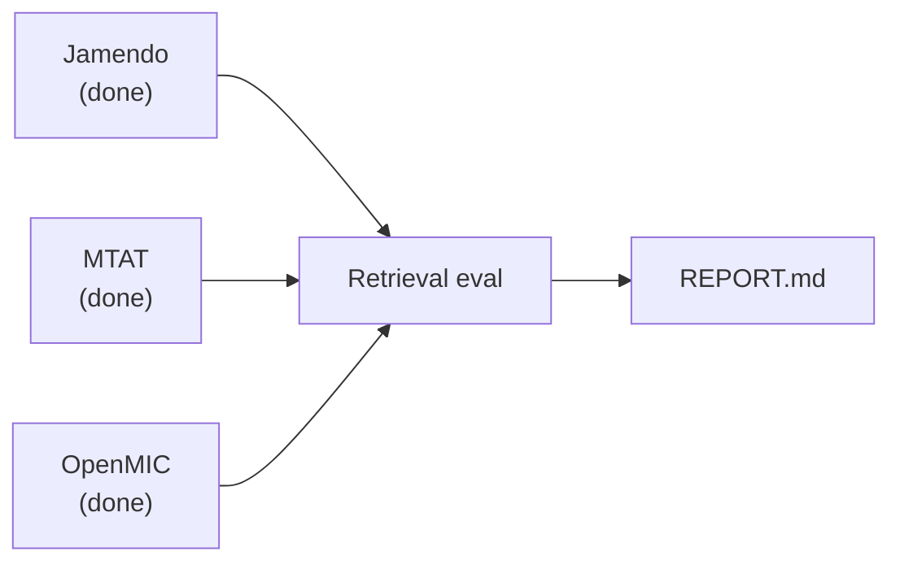

# Progress monitor

*Auto-generated — do not edit by hand. Last refresh: `2026-06-18T03:58:44Z`*

Refresh:

```bash
bash scripts/refresh_progress.sh
```

Guide: [`docs/PROGRESS_MONITOR.md`](PROGRESS_MONITOR.md). Objectives: [`docs/THESIS_QUESTIONS.md`](THESIS_QUESTIONS.md). Public OOD: [`docs/PUBLIC_OOD_EVAL.md`](PUBLIC_OOD_EVAL.md).

## Thesis questions

| ID | Topic | Status | Report / artifacts |
|----|-------|--------|-------------------|
| **A** | Fine-tune vs pretrained | **partial** | `data/eval/retrieval_vs_random_matrix copy.csv`, `data/eval/retrieval_vs_random_matrix.csv` |
| **B** | Grok vs LLM captions | **done** | `data/eval/llm_full_ablation/REPORT.md`; thesis_llm_full_llm: 3/3 seeds |
| **C** | Self-train loop | **done** | — |
| **D** | Tag-only vs tag→LLM | **done** | `data/eval/tag_llm_ablation/REPORT.md`; thesis_tag_only: 3/3 seeds; thesis_tag_llm: 3/3 seeds |

## Question D pipeline

| Unit | Step | State | Detail |
|------|------|-------|--------|
| 0 | Tag JSONL | **done** | lines=65041 |
| 1 | Llama tag→text | **done** | song_lines=3440, clip_lines=65041 |
| 2 | Audio cache | **done** | cache_index_bytes=13272331 |
| 3 | FT thesis_tag_only (seeds 42–44) | **done** | n_complete=3, n_total=3 |
| 4 | FT thesis_tag_llm (seeds 42–44) | **done** | n_complete=3, n_total=3 |
| 5 | Gold eval + REPORT.md | **done** | — |

## Question D — training recipe

Does tag→LLM training text beat short tag strings for gold tag retrieval?

**Two arms — only training text differs:**

| Arm | Run ID | Train JSONL | Text paired with each clip |
|-----|--------|-------------|----------------------------|
| Tag-only | `thesis_tag_only` | `data/mapping/clap_train_tag.jsonl` | Short tags from gold multihot (piano, vocal, relaxing) or fallback "music" |
| Tag→LLM | `thesis_tag_llm` | `data/mapping/clap_train_tag_llm.jsonl` | Llama-expanded sentence per song (same tags), copied to all 15s clips |

**Shared setup:**

- **Train clips:** 65041 (`data/mapping/clap_train_tag.jsonl`)
- **Val:** `data/mapping/clap_val_15s.jsonl` — Grok-style captions on held-out clips (same val for both arms)
- **Audio:** 15s segments under data/music_db_15s/; backbone audio cache used at train time
- **Backbone / loss:** Frozen CLAP AudioSet; train audio/text projection + transform heads; Contrastive (scaled audio–text similarity, batch cross-entropy)
- **Params:** `data/eval/llm_ablation/train_params.json`

**Seeds & stop rule:**

- **Seeds:** 42, 43, 44 (one checkpoint per seed)
- **Max epochs:** 20; **batch size:** 32
- **Early stop:** maximize `val_similarity`, patience 2, min_epochs 5
- **Note:** val_similarity = mean diagonal audio–text match on val JSONL; not the thesis retrieval metric (P@K / nDCG on gold — Unit 5)

**Thesis result (after Unit 5):** Gold retrieval vs random → data/eval/tag_llm_ablation/REPORT.md (Unit 5)


## Fine-tune seeds

*Per seed: **ok** = checkpoint + complete; number is **best** val_similarity at best epoch (from `training_complete.json`, not last epoch).*

- **`thesis_tag_only`** — 3/3 complete — seed_42: ok (ep5 val=0.9079), seed_43: ok (ep5 val=0.9079), seed_44: ok (ep5 val=0.9079)
- **`thesis_tag_llm`** — 3/3 complete — seed_42: ok (ep6 val=0.5465), seed_43: ok (ep6 val=0.5465), seed_44: ok (ep6 val=0.5465)
- **`thesis_ft_v1`** — 0/3 complete — seed_42: …, seed_43: …, seed_44: …
- **`thesis_llm_full_llm`** — 3/3 complete — seed_42: ok (ep4 val=0.4803), seed_43: ok (ep4 val=0.4803), seed_44: ok (ep4 val=0.4803)

## Public OOD pipeline

*Post-train external retrieval — separate from Question A–D. Overall: **partial**. Orchestrator: `bash scripts/run_public_ood_pipeline.sh`*



| Unit | Step | State | Detail |
|------|------|-------|--------|
| 0 | Jamendo five-tag download + manifest | **done** | audio_ready=297/297, download_status=— |
| 1 | MTAT download + manifest | **done** | audio_ready=179/179, download_status=COMPLETED |
| 2 | OpenMIC download + manifest | **done** | audio_ready=120/120, download_status=COMPLETED |
| 3 | Public retrieval eval (per-arm CSVs) | **running** | csvs=3/36, datasets_ready=jamendo,mtat,openmic, arms=pretrained,thesis_ft_v1,thesis_tag_only,thesis_tag_llm |
| 4 | Combined data/eval/REPORT.md | **running** | report_exists=False |

### Prep & eval progress

| Dataset | Prep (audio) | Eval CSVs |
|---------|--------------|-----------|
| **jamendo** | `████████████████ 297/297 (100%)` | `████░░░░░░░░░░░░ 3/12 (25%)` |
| **mtat** | `████████████████ 179/179 (100%)` | `░░░░░░░░░░░░░░░░ 0/12 (0%)` |
| **openmic** | `████████████████ 120/120 (100%)` | `░░░░░░░░░░░░░░░░ 0/12 (0%)` |

### Eval matrix (CSV seeds per arm)

| Dataset | pretrained | thesis_ft_v1 | thesis_tag_only | thesis_tag_llm |
|---------|--------|--------|--------|--------|
| **jamendo** | 3/3 | 0/3 | 0/3 | 0/3 |
| **mtat** | 0/3 | 0/3 | 0/3 | 0/3 |
| **openmic** | 0/3 | 0/3 | 0/3 | 0/3 |

Combined report: — *(after unit 4)* (total CSVs 3/36 for prep-ready datasets; arms: pretrained, thesis_ft_v1, thesis_tag_only, thesis_tag_llm; seeds 42–44).

Download snapshot (`refresh_download_status.sh`, `2026-06-18T03:58:44Z`): Jamendo MP3 297/297, MTAT mp3 25863, OpenMIC ogg 20000.

**Next commands:**

```bash
bash scripts/status_public_eval_download.sh
DATASETS="jamendo mtat openmic" ARMS="pretrained thesis_tag_only thesis_tag_llm" SKIP_EXISTING=1 sbatch scripts/sbatch_public_eval.sh
```

Guide: [`docs/PUBLIC_OOD_EVAL.md`](PUBLIC_OOD_EVAL.md). Download status: `bash scripts/status_public_eval_download.sh`.


## Recent Slurm jobs

### Job `121728` (running)
- Log: `slurm-121728.out` (mtime `2026-06-18T08:53:28Z`)
- Phase: `unknown`
- Tail:
```
Embed jamendo audio:   5%|▌         | 1/19 [00:08<02:37,  8.76s/batch]
Embed jamendo audio:  11%|█         | 2/19 [00:15<02:07,  7.52s/batch]Warning: Xing stream size off by more than 1%, fuzzy seeking may be even more fuzzy than by design!
Embed jamendo audio:  16%|█▌        | 3/19 [00:26<02:24,  9.06s/batch]
Embed jamendo audio:  21%|██        | 4/19 [00:34<02:08,  8.59s/batch]
Embed jamendo audio:  26%|██▋       | 5/19 [00:43<02:01,  8.71s/batch]
Embed jamendo audio:  32%|███▏      | 6/19 [00:52<01:58,  9.11s/batch]
Embed jamendo audio:  37%|███▋      | 7/19 [01:03<01:54,  9.54s/batch]
Embed jamendo audio:  42%|████▏     | 8/19 [01:12<01:44,  9.49s/batch]
```

### Job `121212` (failed)
- Log: `slurm-121212.out` (mtime `2026-06-09T10:40:21Z`)
- Phase: `public_ood_download`
- Tail:
```
  Extracting tarball (may take several minutes)
================================================================
[05:42:57] Extracting /home/mc46451/music-recommendation/data/public_eval/openmic/openmic-2018-v1.0.0.tgz (may take several minutes)
/home/mc46451/music-recommendation/scripts/download_openmic_backend.sh: line 63: syntax error near unexpected token `may'
!!!!!!!!!!!!!!!!!!!!!!!!!!!!!!!!!!!!!!!!!!!!!!!!!!!!!!!!!!!!!!!!
  ERROR: public-dl Slurm job FAILED (exit 2)
  Check: bash scripts/status_public_eval_download.sh
!!!!!!!!!!!!!!!!!!!!!!!!!!!!!!!!!!!!!!!!!!!!!!!!!!!!!!!!!!!!!!!!
```

### Job `121214` (failed)
- Log: `slurm-121214.out` (mtime `2026-06-09T09:37:17Z`)
- Phase: `public_ood_download`
- Tail:
```
           ^^^^^^^^^^^^^^^^^^^^^^^^^^
  File "/home/mc46451/miniconda3/envs/ragweb/lib/python3.11/json/decoder.py", line 340, in decode
    raise JSONDecodeError("Extra data", s, end)
json.decoder.JSONDecodeError: Extra data: line 1 column 67 (char 66)
!!!!!!!!!!!!!!!!!!!!!!!!!!!!!!!!!!!!!!!!!!!!!!!!!!!!!!!!!!!!!!!!
  ERROR: public-dl Slurm job FAILED (exit 1)
  Check: bash scripts/status_public_eval_download.sh
!!!!!!!!!!!!!!!!!!!!!!!!!!!!!!!!!!!!!!!!!!!!!!!!!!!!!!!!!!!!!!!!
```

### Job `121213` (failed)
- Log: `slurm-121213.out` (mtime `2026-06-09T09:34:22Z`)
- Phase: `public_ood_download`
- Tail:
```
  zip -s 0 mp3.zip.001 failed (need zip parts .001-.003 with correct sizes)
  Log: /home/mc46451/music-recommendation/data/log/public_eval_downloads/mtat_backend.log
  Check: bash scripts/status_public_eval_download.sh
!!!!!!!!!!!!!!!!!!!!!!!!!!!!!!!!!!!!!!!!!!!!!!!!!!!!!!!!!!!!!!!!
!!!!!!!!!!!!!!!!!!!!!!!!!!!!!!!!!!!!!!!!!!!!!!!!!!!!!!!!!!!!!!!!
  ERROR: public-dl Slurm job FAILED (exit 1)
  Check: bash scripts/status_public_eval_download.sh
!!!!!!!!!!!!!!!!!!!!!!!!!!!!!!!!!!!!!!!!!!!!!!!!!!!!!!!!!!!!!!!!
```

### Job `121211` (failed)
- Log: `slurm-121211.out` (mtime `2026-06-09T09:29:26Z`)
- Phase: `public_ood_download`
- Tail:
```
  Script crashed — see log above for the first error
  Log: /home/mc46451/music-recommendation/data/log/public_eval_downloads/mtat_backend.log
  Check: bash scripts/status_public_eval_download.sh
!!!!!!!!!!!!!!!!!!!!!!!!!!!!!!!!!!!!!!!!!!!!!!!!!!!!!!!!!!!!!!!!
!!!!!!!!!!!!!!!!!!!!!!!!!!!!!!!!!!!!!!!!!!!!!!!!!!!!!!!!!!!!!!!!
  ERROR: public-dl Slurm job FAILED (exit 1)
  Check: bash scripts/status_public_eval_download.sh
!!!!!!!!!!!!!!!!!!!!!!!!!!!!!!!!!!!!!!!!!!!!!!!!!!!!!!!!!!!!!!!!
```
