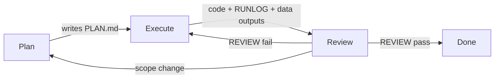

# Multi-agent workflow: Plan → Execute → Review (Ragweb)

This repository uses a **three-phase handoff** stored as files under `docs/agent_runs/`. It is not a separate LLM runtime: any Cursor chat (or human) can adopt the **Plan**, **Execute**, or **Review** role by reading and writing the same artifacts.

## Why use it

- Chat history resets; **PLAN.md**, **RUNLOG.md**, and **REVIEW.md** stay in git.
- Thesis claims need **reproducible commands** and **verification**, not ad-hoc edits.
- The project rule [`.cursor/rules/ragweb_agent_pipeline.mdc`](../.cursor/rules/ragweb_agent_pipeline.mdc) reminds the AI to follow this on non-trivial work.

## Flow

| Phase | Owner | Output |
|-------|--------|--------|
| **Plan** | Human or AI | `PLAN.md` — goal, inputs, commands, expected paths, risks |
| **Execute** | Human or AI | Code changes + `data/...` artifacts + append `RUNLOG.md` |
| **Review** | Human or AI | `REVIEW.md` — checklist, pass/fail, defects or approval |

## When to use all three phases

Use the full loop for: new eval logic, metric definition changes, gold merge behavior, FAISS pipeline changes, or anything that affects thesis numbers.

**Skip or shorten** for: typos, one-line fixes, comments-only changes (still run tests if applicable).

## Convention: one folder per run

Create a run folder:

`docs/agent_runs/<run_id>/`

Suggested `run_id`: `YYYYMMDD_short_topic` (e.g. `20260210_retrieval_matrix`).

Minimum files:

- `PLAN.md` — copy from [docs/templates/agent_plan.template.md](templates/agent_plan.template.md)
- `RUNLOG.md` — copy from [docs/templates/agent_runlog.template.md](templates/agent_runlog.template.md); append after each command batch
- `REVIEW.md` — copy from [docs/templates/agent_review.template.md](templates/agent_review.template.md); fill when Execute is done

See [docs/agent_runs/README.md](agent_runs/README.md) for git / traceability notes.

## Example Cursor prompts

**Plan**

> Create `docs/agent_runs/20260210_example/PLAN.md` from the plan template. Task: [describe]. List exact commands from AGENTS.md / README and expected output files.

**Execute**

> Follow `docs/agent_runs/20260210_example/PLAN.md`. Implement or run commands; append each step to `RUNLOG.md` with exit codes and paths.

**Review**

> Verify outputs against PLAN. Complete `REVIEW.md` with pass/fail and list any defects. Do not approve if metric definitions or join keys are wrong.

## Project context (read first)

- [AGENTS.md](../AGENTS.md) — durable snapshot: CLAP paths, eval scripts, two zero-shot meanings, gold vs random matrix.
- [README.md](../README.md) — setup, end-to-end commands, human Top‑K workflow.
- [docs/README_eval_merge.md](README_eval_merge.md) — gold merge keys and paths.

## Commands often referenced in PLAN

From AGENTS / README (non-exhaustive):

- Metadata FAISS: `python -m app.metadata_faiss build`
- Tempo zero-shot: `python -m app.data_handling.music_eval_zeroshot_tempo`
- Retrieval matrix: `python -m app.data_handling.music_eval_retrieval_vs_random`
- Gold merge: `python -m app.data_handling.music_eval_merge_gold`

Adjust paths and flags in each PLAN to match your machine and experiment.
